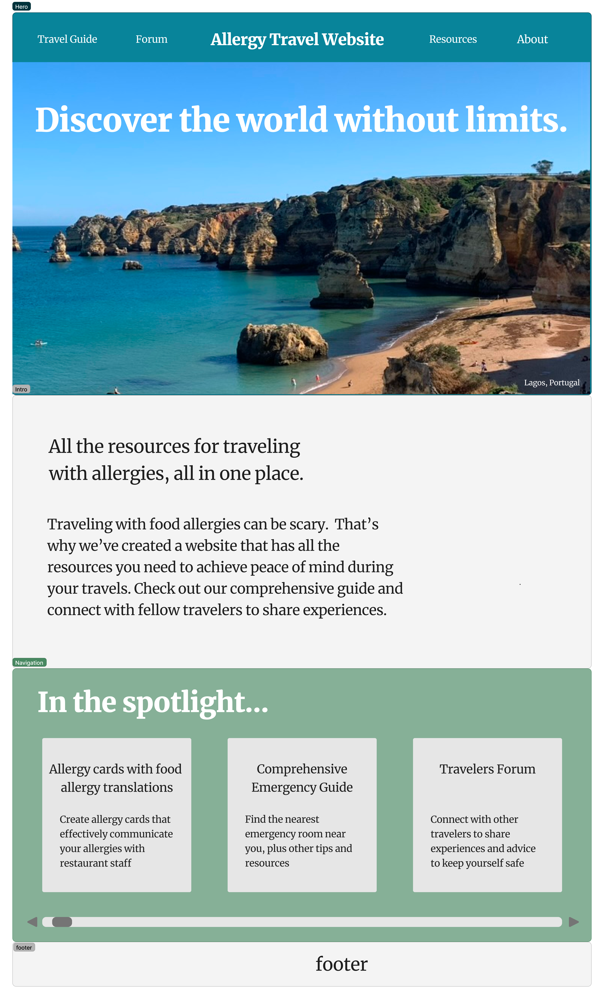
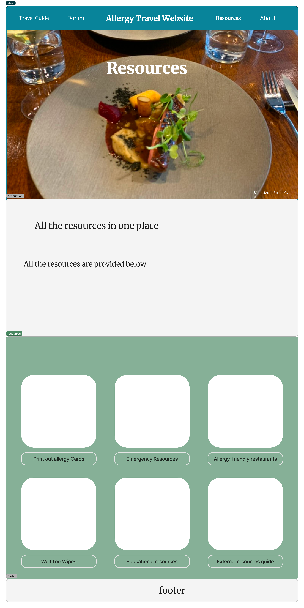
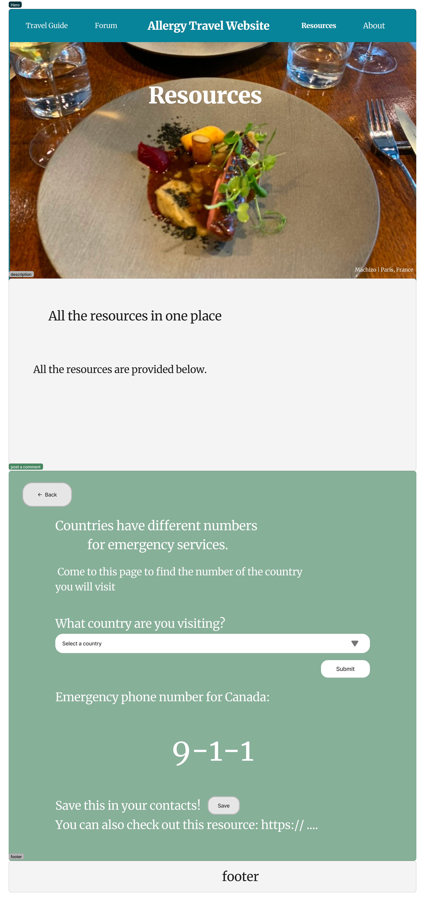
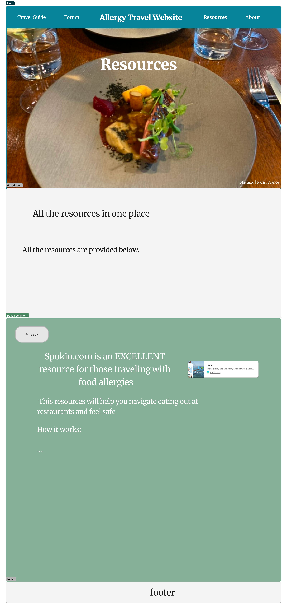

# chaia-billan-capstone

# Traveling with allergies

## Overview

Traveling with food allergies can be daunting and stressful, especially when navigating unfamiliar cuisines and languages. Our app aims to provide a comprehensive resource for travelers with food allergies, offering essential information, tools, and a supportive community to help them feel confident and safe during their adventures.


### Problem

Oftentimes, while traveling, eating out is one of the most exciting aspects! It's a great social activity, and trying traditional foods can be delicious and eye-opening. However, it can be frightening for those who have food allergies, especially when the servers dont speak English. This fear is exacerbated when traveling alone because there may not be anyone in the vicinity who is able to help you in the case of an emergency. There is quite a deficit of educational resources online for this specific situation, and those that are available are difficult to find without word-of-mouth referrals. This may prevent people with food allergies from believing that they are cabable of traveling to certain places.


### User Profile

- Travelers with food allergies:
    - wanting to educate themselves about how to stay safe when eating out abroad
    - want to feel more confident in their ability to travel safely
    - want to have a website that they can refer back to in the future that has all the information in place


### Features

List the functionality that your app will include. These can be written as user stories or descriptions with related details. Do not describe _how_ these features are implemented, only _what_ needs to be implemented.

- As a user, I want to be able to create "chef cards" that I can show to restaurant staff. These will explain my allergies in the official language of the country I am viting to ensure understanding. 

- As a user, I want a comprehensive guide for eating out at restaurants in foreign countries (how to plan which restaurants to eat at, how to communicate with the restaurant staff, how to clean the table before eating)

- As a user, I want access to a forum where I can read other users posts about their tips and experiences regarding allergy-safety while traveling. I also want to be able to post questions about my concerns that others can respond to. 
    - I want to filter the advice by subject and likes for an easy viewing experience

- As a user, I want to be able to quickly find the emergency phone number of the country I am visiting (9-1-1 equivalent) which I can then add to my contacts.

- As a user, I want access to advice in regards to reading menus and food labels in different languages

- As a user, I want to learn about what scenario kits are and when to use them 

- As a user, I want to easily find external resources that are also helpful in this situation (e.g, spokin.com)

- As a user, I want access to educational resources
    - Offer articles, videos, and infographics about food allergies, including information on different types of allergies, symptoms, treatment options, and allergy management strategies.
    - maybe point them towards yummly or something to find easy recipes because i think thats beyond the scope of this 


## Implementation

### Tech Stack

- React
- TypeScript
- MySQL
- Express
- JWT
- Client libraries: 
    - react
    - react-router
    - axios
- Server libraries:
    - knex
    - express
    - axios
    - bcrypt for password hashing (optional)

### APIs

List any external sources of data that will be used in your app.

https://emergencynumberapi.com/
- API that has emerngency information for each city 
    - links emergency rooms to google maps 
    - provides the emergency phone number of that country

### Sitemap

List the pages of your app with brief descriptions. You can show this visually, or write it out.

Homepage 
    - nav bar that points
    - hero section with an inspirational quote 

About 
    - about the author 
    - share a picture from travels 
    - share your story 
        - most difficult part of travels 
        - travelling alone is already hard
        - let alone with the worries of this 
    - driven by my own desire to enable myself to travel with less anxiety and fear 
    
Community page
    - this is where people can post advice, experiences, and questions
    - people can reply and like these posts
    - when you post a comment, you must specify the subject
        - when reading other peoples posts, you can filter by subject in order to find what youre looking for

Travel Guide Page
    - this page will have different sections for flights, eating at restaurants, etc.
    - in each section, I will write my best advice for traveling with food allergies and i will link all the resources that I mention to the specific resource on the resources page 

Resources Page
    - this page will have a list of resources, whether they were created by me (find the emergency phone number), or are an external resource
    - when you click on one, that component will change to display the component that was clicked on. it will remain on the same resources page though. 


### Mockups

Provide visuals of your app's screens. You can use tools like Figma or pictures of hand-drawn sketches.






()



### Data

Comments Table: This table would store the comments posted by users. It might have columns such as:
- comment_id (Primary Key): A unique identifier for each comment.
- username: The name of the user who posted the comment.
- comment_text: The actual comment text.
- timestamp: The timestamp of when the comment was posted.
- likes_count: Tracks the number of likes for each comment.

Replies Table: This table would store the replies to individual comments. It might have columns like:
- reply_id (Primary Key): A unique identifier for each reply.
- comment_id (Foreign Key): The identifier of the comment to which the reply belongs.
- username: The name of the user who posted the reply.
- reply_text: The text of the reply.
- timestamp: The timestamp of when the reply was posted.


### Endpoints

List endpoints that your server will implement, including HTTP methods, parameters, and example responses.

**GET api/country/{code}**

- get the emergency phone number for a selected country 

Parameters: none

Response: 
```
{
    "disclaimer": "The data from this API is provided without any claims of accuracy, you should use this data as guidance, and do your own due diligence.",
    "error": "",
    "data": {
        "country": {
            "name": "Canada",
            "ISOCode": "CA",
            "ISONumeric": "124"
        },
        "ambulance": {
            "all": [
                ""
            ],
            "gsm": null,
            "fixed": null
        },
        "fire": {
            "all": [
                ""
            ],
            "gsm": null,
            "fixed": null
        },
        "police": {
            "all": [
                ""
            ],
            "gsm": null,
            "fixed": null
        },
        "dispatch": {
            "all": [
                "911"
            ],
            "gsm": [
                "112"
            ],
            "fixed": null
        },
        "member_112": false,
        "localOnly": false,
        "nodata": false
    }
}
```

**GET /api/comments**

- get all comments 

Parameters: none

Response: 
```
[
  {
    "comment_id": 1,
    "username": "user1",
    "comment_text": "This is the first comment.",
    "timestamp": 1647628800,
    "replies": [
      {
        "reply_id": 1,
        "username": "user2",
        "reply_text": "Reply to the first comment.",
        "timestamp": 1647661200
      }
    ]
  },
  {
    "comment_id": 2,
    "username": "user3",
    "comment_text": "This is the second comment.",
    "timestamp": 1647661200,
    "replies": []
  }
]
```

**POST /api/comments**

- post a new comment 

Parameters: 
username (string): The name of the user posting the comment.
comment_text (string): The text of the comment.

Response: 
```
{
  "comment_id": 3,
  "username": "user4",
  "comment_text": "This is a new comment.",
  "timestamp": "2024-03-18T12:15:00Z"
}
```

**POST /api/comments/:comment_id/replies**

- post a reply to an existing comment 

Parameters:
comment_id (integer): The ID of the parent comment.
username (string): The name of the user posting the reply.
reply_text (string): The text of the reply.

Response: 
```
{
  "reply_id": 2,
  "username": "user5",
  "reply_text": "Reply to the first comment's reply.",
  "timestamp": "2024-03-18T12:20:00Z"
}
```

**POST /api/comments/:comment_id/like**

- like a comment 

Parameters:
comment_id (integer): The ID of the comment to like.

Response: 
```
{
  "message": "Comment liked successfully."
}
```

**DELETE /api/comments/:comment_id**

- delete a comment 

Parameters:
comment_id (integer): The ID of the comment to delete.

Response: 
```
{
  "message": "Comment deleted successfully."
}
```

**POST /api/comments/:comment_id/replies/:reply_id/like**

- like a reply

Parameters:
comment_id (integer): The ID of the parent comment.
reply_id (integer): The ID of the reply to like.

Response: 
```
{
  "message": "Reply liked successfully."
}
```

**DELETE /api/comments/:comment_id/replies/:reply_id**

- delete a reply

Parameters:
comment_id (integer): The ID of the parent comment.
reply_id (integer): The ID of the reply to delete.

Response: 
```
{
  "message": "Reply deleted successfully."
}
```


### Auth

Does your project include any login or user profile functionality? If so, describe how authentication/authorization will be implemented.

This would be implemented if I have enough time at the end. 
    - the user would be able to login in order to
        - see notifications
            - if anyone liked or responded to their post
        - access saved content such as recipes, articles, posts, etc.

## Roadmap

Scope your project as a sprint. Break down the tasks that will need to be completed and map out timeframes for implementation. Think about what you can reasonably complete before the due date. The more detail you provide, the easier it will be to build.

Sprint 1 
Thursday March 21 - Friday March 22
    - create the react app for client side
    - create the server side using express
    - create the database that will hold posts 
        - create seed files with some mock data
    - connect these all together and test using postman
    - familiarize self with API that I will use and test different endpoints 
    - create basic website layout 
        - create pages and component files
        - create routes/endpoints for each page 

Sprint 2
Saturday March 23 - Monday March 25
- Implement back and front-end feature for accessing emergency phone numbers.
- Build front and back-end community forum functionality for posting and browsing user-generated content.

Sprint 3
Tuesday March 26 - Thursday March 28
- Develop comprehensive travel guide section with tips and resources for allergy-safe traveling.
- Create About the Author section - write bio and import photos
- Integrate use params into resources directory section for functionality of which resource is showing.

Sprint 4
Friday March 29 - Sunday March 31 
- Finalize front end design for optimal user experience.
- Implement authentication functionality for user profiles (if time permits).

Monday April 1 
    - submit project on synapse

Tuesday April 2 - Wednesday April 3
    - prepare for presentations 


## Nice-to-haves

Your project will be marked based on what you committed to in the above document. Under nice-to-haves, you can list any additional features you may complete if you have extra time, or after finishing.

- auth
    - let the user login in order to save articles, comments, info etc.
    - this would have to be on the client and server side 

- common allergy related phrases in different languages 
    - e.g., i am having an allergic reaction can you please help me/call an ambulance 

- collection of allergy-friendly recipes that travelers can cook easily in their accomodations 
    - these should have very few ingredients
    - maybe you can choose to display some with a certain amount of ingredients 
    - filter for 
        - dietary restriction 

- compile a list of restaurants that are "allergy friendly"
    - allow users to submit reviews and ratings based on their experiences 
    - filter for 
        - location relative to the person 
        - type of cuisine
    - spokin.com

- information about what traditional dishes from a certain cuisine would be suitable to order at a restaurant
    - For example, if you’re allergic to soy and want to eat at a Chinese restaurant, it will spotlight Chinese dishes and ingredients that typically contain soy sauce. If you’re allergic to dairy and plan to dine out at an Italian eatery, it’ll flag ingredients and dishes containing cheese.